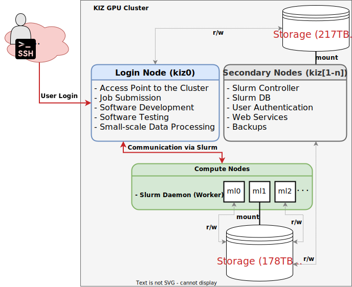
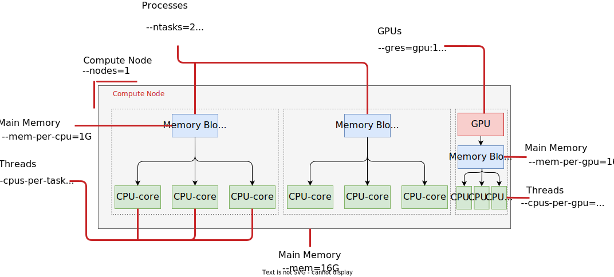

## Getting Started

To gain access to the cluster, the first step is to apply for a user account. 
Follow the steps outlined [here](../#apply-for-an-account) to request access. 

The login is done via SSH using [Public-Key Authentication](https://en.wikipedia.org/wiki/Public-key_authentication). 
Thus, an initial key pair (e.g., using `ssh-keygen`) needs to be generated. 
A detailed guide on creating SSH key pairs can be found, for example, [here](https://www.heise.de/tipps-tricks/SSH-Key-erstellen-so-geht-s-4400280.html).

Upload the **public key** (file extension `.pub`) in the "[Upload SSH Public Key](https://elearning.ohmportal.de/mod/assign/view.php?id=14861)" section of our Moodle course. 
If you do not have access to our Moodle (e.g. external researchers), please contact our administrators via [kiz-slurm@th-nuernberg.de](mailto:kiz-slurm@th-nuernberg.de) for further instructions. 

Please provide the key in **OpenSSH format** (see notes [below](#notes-on-openssh-key-format) for further information).

You will receive a notification via email once your user account has been created. 
Please note that the account creation process may take some time. 
In the meantime, you can familiarize yourself with this user guide and work on the tasks in the Moodle course. 

**For THN students:** Please note that your account will only be activated after all tasks in the Moodle course have been submitted and evaluated.

After creating the user account, you can connect to the cluster via **SSH**. 
Login to the *Controlhost* can be done, for example, with `ssh <username>@<hostname>` or `ssh <username>@<ip_address>`. 
The IP addresses and hostnames of our systems can be found in [Moodle](https://elearning.ohmportal.de/course/view.php?id=372). 

Users who already have experience with HPC clusters can define jobs based on the template in the [Template section](#template) and execute them from the *Controlhost*. 
For all others, it is recommended to first familiarize themselves with the cluster using this documentation.

### Notes on OpenSSH Key Format

The OpenSSH key format is typically used in Unix-based operating systems. 
Public keys in OpenSSH format start as follows:

```bash
ssh-rsa AAAAB3...
```

Another commonly used format is SSH2. 
This format is often the default format in SSH clients on Windows (e.g., [PuTTY](https://www.putty.org/)).

Public keys in SSH2 format are structured as follows:

```bash
---- BEGIN SSH2 PUBLIC KEY ----
Comment: "rsa-key-20220502"
AAAAB3
...
---- END SSH2 PUBLIC KEY ----
```

To gain access to the servers of the KIZ HPC cluster, **the key must be uploaded in OpenSSH format**. 
Conversion from SSH2 to OpenSSH is possible, for example, using the `ssh-keygen` tool:

```bash
ssh-keygen -i -f ssh2.pub
```

### Troubleshooting SSH

Usually, the problems occuring during connection attempts are due to key pairs with custom names (i.e. not automatically generated names) and/or are not stored in a directory checked by the SSH client. 

Therefore, ensure that your SSH client uses the **correct key** to establish the connection and that your key pair is provided in the correct directory with the [correct permissions](https://superuser.com/questions/215504/permissions-on-private-key-in-ssh-folder).

Hints about the directories where the client searches for keys or which keys are used for authentication are provided by the `-v` argument (e.g., `ssh -vvv <username>@<hostname>`).

To ensure that the right key is used for the connection, you can also pass the private key as an argument to the command (`ssh -i /path/to/private_key <username>@<hostname>`). 
Alternatively, connection parameters can be defined with a configuration file. 
Configuration files are named `config` and can look like this:

```bash
# ~/.ssh/config

Host kiz_cluster_controlhost
  HostName <hostname_of_controlhost>
  User <username>
  IdentityFile ~/.ssh/<my-private-key>
```

Another common issue is the accidental use of the wrong username. 
If you don't set the username explicitely in the SSH command (`ssh <username>@<hostname>`) or via the `~/.ssh/config`, the SSH client will use the username of your local PC, which is likely not the same as your username for the cluster. 
Cluster usernames follow the THN standard scheme (e.g. *mustermannma12345* for students and *mustermannma* for staff).

#### Public Keys via Email

In case you send your public key via email (e.g. because you don't have access to Moodle), please make sure that the file **does not contain line breaks, spaces, or any other formatting**. 
Ideally, send the key as an attachment and do not copy it into the body of the email.

## Slurm Workload Manager

Resource management and job scheduling in the KIZ HPC cluster are controlled by the [Slurm](https://slurm.schedmd.com/overview.html) workload manager.

Slurm fulfills three important functions:

- Allocation of resources (compute nodes, CPU cores, memory, time, etc.) based on user requests.
- Starting, executing, and monitoring jobs on the cluster.
- Building a queue for existing resource requests.

As a rule of thumb for resource allocation:

- The more resources (CPUs, GPUs, RAM, and time) a task requires, the longer it takes for the job to start.
- To minimize wait time, you should determine in advance (as accurately as possible), which resources are actually needed for the respective task.

The *Controlhost* is your login node and the place where you submit jobs to the workload manager (i.e., Slurm) for execution on the compute nodes.

## Available Resources

The rough allocation of resources in Slurm is done using a so-called *Quality of Service* (QOS).
Depending on the use case, certain types of resources are particularly needed (e.g., plenty of memory for data preprocessing).
The different use cases can be covered by specifying the respective QOS in a Slurm job.

Users can have access to the following resources on the cluster:

<div class="table-responsive">
  <table class="table table-striped table-hover table-bordered">
    <thead>
      <tr>
        <th><strong>QOS</strong></th>
        <th><strong>Jobs per User</strong></th>
        <th><strong>Wall Duration per Job</strong></th>
        <th><strong>CPUs</strong></th>
        <th><strong>Memory</strong></th>
        <th><strong>GPUs</strong></th>
        <th><strong>Comment</strong></th>
      </tr>
    </thead>
    <tbody>
      <tr>
        <td>interactive</td>
        <td>5</td>
        <td>8 hours</td>
        <td>16</td>
        <td>128GB</td>
        <td>1</td>
        <td>Specifically for interactive sessions</td>
      </tr>
      <tr>
        <td>basic</td>
        <td>10</td>
        <td>16 hours</td>
        <td>16</td>
        <td>128GB</td>
        <td>1</td>
        <td>Default QOS for students</td>
      </tr>
      <tr>
        <td>advanced</td>
        <td>20</td>
        <td>24 hours</td>
        <td>16</td>
        <td>256GB</td>
        <td>1</td>
        <td>Default QOS for staff members (<em>upon request</em> for others)</td>
      </tr>
      <tr>
        <td>ultimate</td>
        <td>50</td>
        <td>48 hours</td>
        <td>16</td>
        <td>256GB</td>
        <td>1</td>
        <td><em>upon request</em></td>
      </tr>
      <tr>
        <td>bigmem</td>
        <td>10</td>
        <td>12 hours</td>
        <td>16</td>
        <td>1TB</td>
        <td>-</td>
        <td>For jobs that require a lot of main memory; <em>upon request</em></td>
      </tr>
      <tr>
        <td>gpubasic</td>
        <td>10</td>
        <td>96 hours</td>
        <td>16</td>
        <td>256GB</td>
        <td>1</td>
        <td>For long-running GPU jobs; <em>upon request</em></td>
      </tr>
      <tr>
        <td>gpuultimate</td>
        <td>10</td>
        <td>48 hours</td>
        <td>64</td>
        <td>768GB</td>
        <td>4</td>
        <td>For jobs that are not feasible on a single GPU; <em>upon request</em></td>
      </tr>
    </tbody>
  </table>
</div>

The values in the table represent **maximum values** available within the respective Quality of Service. 
They do not necessarily need to be fully utilized. 
In fact, we encourage users not to allocate all of the available resources simply because it's possible, to minimize their own wait time and to give other users a chance to receive faster job allocation.  

Information on granular resource control can be found, for example, in the section [Creating Jobs](#creating-jobs).

The use of a specific QOS is controlled using the argument `--qos=[qos_name]`.

QOS definitions marked with *upon request* in the comment column can be enabled when needed. 
To do so, please contact our administrators at [kiz-slurm@th-nuernberg.de](mailto:kiz-slurm@th-nuernberg.de), as soon as you can estimate the required resources.

The e-mail should contain the following: 
- A brief reason why you need the additional resources
- For students: The name of your advisor and the title of your project 

The following default values have been set (i.e., if custom parameters are not explicitly set, these values apply):

- 2 CPUs per compute node.
- 2 CPUs per allocated GPU.
- 1024 MB of memory per allocated CPU.
- Inactive jobs are automatically terminated after 600 seconds. This value only applies to `srun` and `salloc` and has no effect on batch jobs.

## Cluster Information

Slurm provides numerous commands to receive information about the cluster and the state of your jobs.
For example, the command `sinfo` displays an overview of the partitions available in the cluster, the compute nodes contained in the partition, and their current status:

```bash
# sinfo
PARTITION AVAIL  TIMELIMIT  NODES  STATE NODELIST
p0*          up   infinite      1    mix ml0
p1           up   infinite      1    mix ml1
p2           up   infinite      1    mix ml2
all          up   infinite      3    mix ml[0-2]
```

A partition is a set of compute nodes, i.e., a set of servers designated for executing specific tasks. 
Using the argument `-N`, compute nodes are listed instead of partitions, and using `-l`, additional details about the available resources there are displayed (e.g., `sinfo -N -l`).

The command `squeue` shows a list of jobs and their allocation to nodes and partitions.

```bash
# squeue
JOBID PARTITION     NAME     USER ST       TIME  NODES NODELIST(REASON)
24981        p0 swbd-sp- tarkin PD       0:00      1 (Resources)
24979        p0 svm-w2v2 thrawn  R      26:47      1 ml0
24978        p0 svm-w2v2 thrawn  R      31:58      1 ml0
24977        p0 svm-w2v2 thrawn  R      32:01      1 ml0
```

The above output shows three running jobs. 
Each job is assigned an ID, which can be used, for example, to cancel the job or to query further information. 
Job cancellation is done with `scancel` (e.g., `scancel 24981`). 
Information about a job ID can be displayed with `scontrol show job 24981`.

The `ST` field indicates the status of the job. 
In the above example, three jobs are in the `RUNNING` state (abbreviated as `R`), and one job has the `PENDING` state (abbreviated as `PD`). 
Once a job is submitted to Slurm and is in the queue, it receives the `PENDING` status. 
Typical reasons why a job remains in the `PENDING` state for longer periods include resource availability (i.e., the job waits until the requested resources become available) 
and priority (i.e., the job is queued behind a job with higher priority). 
In the above example, the job entered the `PENDING` state, because not enough resources are currently available on the selected node/paritition. 
The specific reason is indicated in the `NODELIST(REASON)` field. When sufficient resources are available, and the job is sufficiently prioritized, 
it transitions to the `RUNNING` state. If the job terminates without errors, it receives the `COMPLETED` state; otherwise, it receives the `FAILED` state.

The `TIME` field shows how long the job has been in the `RUNNING` state.

Running jobs for the user's own account can be checked with `squeue -u $USER -t RUNNING`.

A detailed guide on using each command and its arguments can be viewed with `man [slurmcommand]` (e.g., `man sinfo`). 
Alternatively, the `--help` argument can also be used (e.g., `sinfo --help`).

## Creating Jobs

Jobs consist of so-called *Resource Requests* and *Job Steps*. *Resource Requests* specify the required number of CPUs/GPUs, the expected duration of the job, or the required memory. *Job Steps* describe the tasks to be performed on the cluster, such as downloading files or executing a Python script. 



The various kinds of resources on one or more compute nodes are controlled via different directives (see figure above). 

### Allocating Resources

As shown in the figure above, resource allocation is a combination of several interrelated parameters. Some resource requirements can be tied directly to the number of tasks (`--ntasks`) or nodes (`--nodes`), while others apply globally or per specific components (like CPUs or GPUs). Below is an explanation of how Slurm handles various resources and their interactions:

- `--ntasks`:
  - Specifies the total number of tasks to run across all nodes, i.e., the total number of individual processes to run. 
  - Affects how resources like memory and CPUs are distributed if tied to `--ntasks`.
- `--ntasks-per-node`:
  - Specifies how many tasks (individual processes) should run on each node.
  - Affects how resources like memory and CPUs are distributed if tied to `--ntasks-per-node`.
- `--array=<start>-<end>%<max_running>`:
  - The `--array` option is used to submit job arrays, which allow you to submit multiple similar jobs with different indices. These indices can then be used to parametrize your jobs. 
  - `<start>` and `<end>`: Define the range of job indices. 
  - `%<max_running>`: (Optional) Limits the maximum number of jobs running simultaneously in the array.
- `--nodes`:
  - Specifies the number of compute nodes to use for the job.
- `--cpus-per-task`:
  - Specifies the number of CPUs allocated to each task.
  - Total CPUs allocated = `--ntasks` × `--cpus-per-task`.
  - Tied to `--ntasks` and `--ntasks-per-node`, as each task is assigned the specified number of CPUs.
  - Relation to `--array`: CPUs are not shared between array jobs; they are allocated separately for each job in the array.
- `--mem`:
  - Specifies the total memory per node for the job.
  - Not tied to `--ntasks` or `--ntasks-per-node`, but is tied to `--nodes` since memory is allocated per node.
  - Relation to `--array`: Each job in the array gets the amount of memory defined with `--mem`. 
- `--mem-per-cpu`:
  - Specifies memory allocated per CPU.
  - Total memory = `--mem-per-cpu` × Total CPUs (determined by `--ntasks`, `--ntasks-per-node` and `--cpus-per-task`).
  - Tied to `--ntasks`, `--ntasks-per-node` and `--cpus-per-task`. 
  - Relation to `--array`: Memory is allocated separately for each job in the array.
- `--gres` (e.g., `--gres=gpu:<num_gpus>`):
  - Specifies the number of generic resources (like GPUs) per node.
  - Not tied to `--ntasks`, ``--ntasks-per-node`` or `--cpus-per-task`.
  - Relation to `--array`: Each job in the array gets the number of GPUs defined with `--gres=gpu:<num_gpus>`. 
- `--mem-per-gpu`:
  - Specifies memory allocated per GPU.
  - Total memory = `--mem-per-gpu` × Total GPUs (determined by `--gres=gpu:<num_gpus>`).
  - Tied to `--gres=gpu:<num_gpus>` but not to `--ntasks`, `--ntasks-per-node` or `--cpus-per-task`. 
  - Relation to `--array`: Memory is allocated separately for each job in the array.

### Defining GPU Jobs 

As mentioned in the previous section, the usage of `--gres=gpu:<num_gpus>` or `--gres=gpu:<gpu_type>:<num_gpus>` is independent of the `--ntasks` and `--ntasks-per-node` directives. 
When you use `--gres=gpu:<num_gpus>`, you are specifying the total number of GPUs you want to allocate **per node** rather than per task. This means, an allocation of `--gres=gpu:1` reserves one GPU for the entire job or job step on that node.

**In most cases** you may want to set `--ntasks=1` and `<num_gpus>` to the desired total number of GPUs. Deep learning frameworks like [PyTorch](https://pytorch.org/tutorials/beginner/dist_overview.html) or wrappers like [Accelerate](https://huggingface.co/docs/accelerate/index) handle multi-GPU setups on their own, i.e., these frameworks only need to *"see"* the correct number of GPUs on the node to spawn subprocesses accordingly. 

If you still want to control the number of GPUs per task specifically, you would combine `--gres` with `--ntasks-per-node` or `--ntasks` depending on how you're setting up tasks across the nodes. Here's an example configuration for specifying GPUs per task:

```bash
#SBATCH --gres=gpu:1            # Total number of GPUs per node
#SBATCH --ntasks=2              # Total number of tasks
```

With this setup, you'll allocate 1 GPU, shared across 2 tasks on that node. If each task needs its own GPU, increase the value of `--gres=gpu:<num_gpus>` accordingly.

**Note:** The `--mem-per-gpu` directive refers to the **main memory (RAM)** on the compute node and not the available High-Bandwidth Memory (HBM) on the GPU. By setting `--gres=gpu:<num_gpus>`, you will always have the full HBM (e.g. 40GB/80GB on an A100) at your disposal. 

### Batch Jobs

One way to create jobs is through a so-called *Submission* script. 
Essentially, this is a normal shell script whose comments are additionally annotated with `SBATCH`. 
A comment introduced with `SBATCH` is interpreted by Slurm as a parameter description for *Resource Requests*. 
A complete list of possible parameters can be found in the `sbatch` man page.

The `SBATCH` directives must always be listed **at the beginning** of the *Submission* script. The only exception is the hashbang (e.g., `#!/bin/bash`) on the first line.

A typical submission script is structured as follows: 

```bash
#!/bin/bash
#
#SBATCH --job-name=test_job
#SBATCH --output=test-%j.out
#SBATCH --error=test-%j.err
#SBATCH --mail-user=email@addresse.de
#SBATCH --mail-type=ALL
#
#SBATCH --nodes=1
#SBATCH --ntasks=1
#SBATCH --time=00:10:00
#SBATCH --cpus-per-task=2
#SBATCH --gres=gpu:1
#SBATCH --mem-per-cpu=500MB

srun hostname
srun cat /etc/*rel*
```

Assuming the *submission* script is named `my_batchjob.sh`, it is submitted to Slurm and executed as a batch job via the command `sbatch my_batchjob.sh`.

The above script reserves two CPUs, one GPU, and 500MB of RAM per allocated CPU (i.e., 1GB in total) for 10 minutes (format `HH:MM:SS`). 
Within this batch job, two *job steps* are to be executed.
In the first step, the hostname of the compute node (`srun hostname`) is printed.
In the second step prints information about the Linux distribution installed on the compute node.

The outputs are stored in the file `test-%j.out`, where `%j` represents the job ID.
Any errors that occur during execution are saved in `test-%j.err`. 
Other placeholder patterns besides `%j` are available to create output filenames. Please refer to the [Slurm documentation](https://slurm.schedmd.com/sbatch.html#SECTION_FILENAME-PATTERN) for a list of available patterns. 

Sending emails is possible via the `--mail-user` parameter.
The type of notification is configured with `--mail-type`.
Common notification types include `ALL`, `BEGIN`, `END`, `FAIL`, and `REQUEUE`.
A complete list of notification types can be found in the [documentation](https://slurm.schedmd.com/sbatch.html).
Of course, the mail parameters can simply be omitted if you do not wish to receive email notifications.
The status email at the end of a job (notification type `END`) includes information about the consumed resources and the duration of the job (similar to the `seff <jobid>` command).
This overview can, for example, be used effectively for optimizing further executions of the same or similar jobs. 

#### Job Template

The following template can be used as a basis for your own batch jobs.
Execution is done with `sbatch name_of_template.sh`. 

```bash
#!/bin/bash
#SBATCH --job-name=job-template   # Short name of the job
#SBATCH --nodes=1                 # Number of nodes needed
#SBATCH --ntasks=1                # Total number of tasks across all nodes
#SBATCH --partition=p0            # Partition used (e.g., p0, p1, p2, or all)
#SBATCH --time=08:00:00           # Total time limit for job runtime (Format: HH:MM:SS)
#SBATCH --cpus-per-task=8         # CPU cores per task
#SBATCH --mem=16G                 # Total main memory per node
#SBATCH --gres=gpu:1              # Total number of GPUs per node
#SBATCH --qos=basic               # Quality-of-Service
#SBATCH --mail-type=ALL           # Type of mail sending (valid values include ALL, BEGIN, END, FAIL, or REQUEUE)
#SBATCH --mail-user=<USERNAME>@th-nuernberg.de # Email address for status mails (Please replace <USERNAME> with valid username)

echo "=================================================================="
echo "Starting Batch Job at $(date)"
echo "Job submitted to partition ${SLURM_JOB_PARTITION} on ${SLURM_CLUSTER_NAME}"
echo "Job name: ${SLURM_JOB_NAME}, Job ID: ${SLURM_JOB_ID}"
echo "Requested ${SLURM_CPUS_ON_NODE} CPUs on compute node $(hostname)"
echo "Working directory: $(pwd)"
echo "=================================================================="

###################### Optional for Python users #######################
# The following environment variables ensure that
# model weights from Huggingface and PIP packages do not land under
# /home/$USER/.cache.
CACHE_DIR=/nfs/scratch/students/$USER/.cache
export PIP_CACHE_DIR=$CACHE_DIR
export HF_HOME=$CACHE_DIR
mkdir -p CACHE_DIR
########################################################

############### Define your own job here ################
srun my_script1
srun my_script2
########################################################
```

### Interactive Jobs

Interactive jobs can be requested by using `salloc` or `srun` with the `--qos=interactive` QOS option: 

```bash
salloc --qos=interactive
```

or alternatively with: 

```bash
srun --qos=interactive --pty bash -i
```

Once the Slurm job starts, a Bash prompt is spawned for your user on the assigned compute node.
The `-i` argument specifies that Bash should be started as an interactive shell.

The environment from the requesting shell (including loaded modules), will be inherited by the interactive job. This means Bash reads the `~/.bashrc` file upon start and executes the commands contained within it.

For more precise specification of required resources, `srun` and `sbatch` accept the same arguments as `sbatch`. For example, the following command allocates an interactive session with 2 CPUs for 10 minutes:

```bash
srun --qos=interactive --cpus-per-task=2 --time=10:00 --pty bash -i
```

Once the Slurm job is running and the resources have been allocated, the program returns to the shell.
All subsequent commands that you enter are then executed considering the allocated resources.
This continues until `exit` is called or a time limit is reached.

**Important Notes:** 

- Interactive jobs with `srun` or `salloc` can only be executed by explicitely setting the **Quality of Service** with `--qos=interactive` (unless when used within a submission script).
- Interactive jobs are not intended for long-running computations that consume a large amount of resources. Instead, they are meant for quick explorations, installations (e.g. setting up virtual environments) or testing your code on the compute node. 

### Attach to a Running Job

Use the following command on the login node to attach to one of your running jobs:

```bash
srun --jobid=<your_job_id> --overlap --pty /bin/bash -l
```

Attaching to a running job can be used e.g. to check GPU utilization via `nvidia-smi` or `nvtop`. 

## Environment Modules

The [Environment Modules](https://modules.readthedocs.io/en/latest/#) tool allows setting environment variables for pre-installed software packages and libraries. 
It allows for different versions of compilers, applications, and libraries to be installed on the host system but only make one specific version available to your shell. 

Available modules can be listed using the command `module avail`:

```bash
# module avail
------------------- /usr/local/Modules/modulefiles -------------------
cuda/11  dot  module-git  module-info  modules  python/anaconda3
```

Modules are loaded using `module load <name>` and can be removed with `module purge` or `module unload`:

```bash
# Load Anaconda3 and Cuda11
module load python/anaconda3 cuda/11
# Unload Anaconda3
module unload python/anaconda3
# Remove all loaded modules
module purge
```

The following example demonstrates the effect of loading and unloading a module on the user environment:

```bash
$ module purge
$ which python
/usr/bin/python
$ module load python/anaconda3
$ which python
/opt/anaconda3/bin/python
$ module unload python/anaconda3
$ which python
/usr/bin/python
```

Loaded modules can be listed with `module list`.

The command `module show <modulename/version>` displays which environment variables the module actually modifies.

Additional information about Environment Modules can be obtained with `module help` or on the [project's documentation page](https://modules.readthedocs.io/en/latest/#). 

Some users require special software packages for their Jobs that are not installed on the nodes. 
One way to provide these packages is the [Spack](https://spack.io/) package manager. 

Spack allows for easily to maintainable separate versions of the same package, and separate installations for different versions or built dependencies. 
However, not all software is available via Spack and sometimes you have to be very specific about what to install (including dependencies).

If you have specific package requirements, please contact our administrators at [kiz-slurm@th-nuernberg.de](mailto:kiz-slurm@th-nuernberg.de). 


## Python
Various Python distributions are available in the cluster.

The default environments include Python 2.7 and Python 3.8 (invoked with `python2` and `python3`, respectively).
Additionally, a recent [Anaconda](https://www.anaconda.com/) distribution is provided.

**Important Note:**

When using Python, **ALWAYS** utilize isolated [virtual environments](https://docs.python.org/3/tutorial/venv.html) and refrain from installing packages **SYSTEM-WIDE**.

A virtual environment can be created and activated using the Python3 standard installation as follows:

```bash
# Creation of the virtual environment
python3 -m venv my-venv
# Activation of the virtual environment
source my-venv/bin/activate
# From here on, packages are installed in my-venv and not system-wide
```

### Anaconda

The Anaconda Distribution is loaded as an [Environment Module](#environment-modules):

```bash
module load python/anaconda3
```

For first use, `conda` needs to be activated:

```bash
# If a shell other than Bash is used, the last parameter should be replaced accordingly, e.g., with zsh or ksh
conda init bash
# Prevents automatic activation of the base environment
conda config --set auto_activate_base false
```

A virtual environment can be created with `conda` as follows:

```bash
# Creating a new environment
conda create --name my-condaenv
# Activating the environment
conda activate my-condaenv
# Installing a package
conda install <somepackage>
# Deactivating the environment
conda deactivate
# Creating an environment with a specific version of Python
conda create --name py38 python=3.8
# List of available environments
conda env list
```

By default, packages and dependencies are installed under `/home/$USER/.conda`.
This path can be changed using `--prefix`, which is advisable since the quota for your home directory 
is quite limited (see [Important Directories](#important-directories) section) and Python package installations 
can quickly consume all of the available storage capacity:

```bash
conda create --prefix /tmp/my-condaenv
```

The following example demonstrates the usage of an Anaconda environment in a batch job:

```bash
#!/bin/bash
#SBATCH --job-name=py-job        # Short name of the job
#SBATCH --nodes=1                # Number of nodes
#SBATCH --ntasks=1               # Total number of tasks across all nodes
#SBATCH --cpus-per-task=2        # CPU cores per task (>1 for multi-threaded tasks)
#SBATCH --mem-per-cpu=2G         # RAM per CPU core
#SBATCH --time=00:01:00          # Maximum runtime (HH:MM:SS)

module purge
module load python/anaconda3
eval "$(conda shell.bash hook)"
conda activate my-condaenv

srun python my_script.py
```

**Note**: In batch jobs, `~/.bashrc` is not sourced, hence the shell is not initialized for the use of Conda environments in batch jobs. 
The initialization needs to be done manually before conda is used via `eval "$(conda shell.bash hook)"`.

#### Using Jupyter

Using Jupyter Notebooks or Jupyter Lab sessions on the cluster is possible but requires some additional steps. 
We acknowledge that Jupyter is widely used in the research community. 
However, we do not recommend using it for long-running jobs on the cluster. 
Expressing the workload as a batch job and running standard Python scripts may be the better option in most cases (cf. Section [Batch Jobs](#batch-jobs)). 
Note that Jupyter Notebooks can be easily converted into plain Python scripts via `jupyter nbconvert --to script [YOUR_NOTEBOOK].ipynb`. 

The notebook and its associated programming environment (e.g., Python3) are executed on the host system (i.e., a compute node in the cluster). 
However, a connection to the respective Jupyter instance can be established using SSH and port forwarding.

Starting a Jupyter Notebook or Jupyter Lab session involves the following steps:

- Start an interactive job with appropriate resources on the compute node:
    - `[login_node]$ srun --qos=interactive --pty --ntasks=1 bash`
- Start the notebook (or lab) server on the compute node:
    - `[compute_node]$ jupyter notebook --no-browser --port=<host_port>`
    - `<host_port>` can be any free port >1000
- Use SSH port forwarding to map the port of the Jupyter instance to a local port:
    - In this case, a direct SSH connection with port forwarding from your own machine to the respective compute node is required:
        - `[local_pc]$ ssh -N -L localhost:<local_port>:localhost:<host_port> <nodename>.in.ohmhs.de`
        - The `<nodename>` can be found, e.g. by running the `hostname` command in your interactive session.
    - `<local_port>` and `<host_port>` are the ports for Jupyter on your local PC and on the compute node, respectively.
    - The local port can be any free port on your own machine. However, it is probably easiest to assign the same port:
        - `[local_pc]$ ssh -N -L localhost:<host_port>:localhost:<host_port> <nodename>.in.ohmhs.de`

## Using the Kaldi ASR Toolkit

The [Kaldi toolkit](http://kaldi-asr.org/) for speech recognition also provides functionalities for running Slurm jobs. 
This is managed by the script `slurm.pl`. The script is located at `egs/wsj/s5/utils/parallel/slurm.pl` within the Kaldi installation.

To incorporate a Kaldi component into Slurm, two steps are required:

1. Creating the configuration file `slurm.conf`.
2. Adjusting the script `cmd.sh`.

Kaldi recipes are already structured so that components requiring parallel execution or where parallel execution makes sense are provided with the appropriate variables from `cmd.sh`.

### Recap - Parallel Execution in Kaldi

This section summarizes the basics of parallel jobs in Kaldi. Readers who already have experience with Kaldi may skip this section.

For example, a Kaldi component for feature extraction is typically structured as follows:

```bash
$cmd JOB=1:$nj $logdir/make_mfcc_${name}.JOB.log \
extract-segments scp,p:$scp $logdir/segments.JOB ark:- \| \
compute-mfcc-feats $vtln_opts $write_utt2dur_opt --verbose=2 \
    --config=$mfcc_config ark:- ark:- \| \
copy-feats --compress=$compress $write_num_frames_opt ark:- \
    ark,scp:$mfccdir/raw_mfcc_$name.JOB.ark,$mfccdir/raw_mfcc_$name.JOB.scp \
    || exit 1;
```

The variable `cmd` contains the invocation of the respective script for parallel execution. 
For example, `cmd` could have the value `"slurm.pl --num_threads 2 --mem 2G --config conf/slurm.conf"`. 
In this case, it is defined that the component should be executed with Slurm.

The tools for parallelization provided by Kaldi follow the pattern `<script>.pl <options> <log-file> <command>`. 
The value set via the variable `cmd` therefore starts a number of parallel jobs defined in `nj` for the feature extraction pipeline, 
consisting of the programs `extract-segments`, `compute-mfcc-feats`, and `copy-feats`. 
The log files are stored separately for each job under `$logdir/make_mfcc_${name}.JOB.log`.

Alternatives to parallel execution with `slurm.pl` are `run.pl` (execution on any system without a specific workload manager) 
or `queue.pl` (execution with Sun GridEngine; not supported in the KIZ cluster).

The variable `cmd` in the example above is set in the script `cmd.sh` and made available with `. ./cmd.sh`.

Detailed information on parallelizing Kaldi jobs can be found in the [documentation](https://kaldi-asr.org/doc/queue.html) or in the respective scripts (e.g., `slurm.pl`).

### slurm.conf

The script `slurm.pl` provides a default configuration (see `default_config_file` in `slurm.pl`). 
However, the configuration should be tailored to the specifications of the KIZ cluster or the respective user group and their QOS. 
To do this, the configuration file `slurm.conf` needs to be created. The file is usually placed in the project directory under `conf/slurm.conf`.

The `slurm.conf` file structure looks as follows:

```bash
command sbatch --export=PATH --partition=p0 --nodes=1 --qos=basic --job-name=testjob
option mem=* --mem-per-cpu=$0
option mem=0   # No change to the qsub_opts
option num_threads=* --cpus-per-task=$0 --ntasks=1 --ntasks-per-node=1
# No change to the qsub_opts
option num_threads=1 --cpus-per-task=1  --ntasks=1 --ntasks-per-node=1 
option max_jobs_run=* 
option gpu=* -N1 -n1 --partition=p0 --mem-per-cpu=4GB --gres=gpu:$0 --cpus-per-task=6
option gpu=0
```

The line starting with `command` defines which parameters are always passed to the workload manager. 
In this case, a batch job is always started on a node of partition `p0` using QOS `basic`.

How the passed parameters (e.g., `slurm.pl --mem 2G`) are treated is also defined in `slurm.conf`. 
For example, if the parameter `--mem 2G` is passed in the parent script and the line `option mem=* --mem-per-cpu=$0` is present in `slurm.conf`, then `--mem-per-cpu=2G` is passed to the Slurm job.

### cmd.sh

The following example shows how the file `cmd.sh` can be structured:
```bash
export train_cmd="slurm.pl --num_threads 2 --mem 2G --config conf/slurm.conf"
export mkgraph_cmd="slurm.pl --mem 8G --config conf/slurm.conf"
export decode_cmd="slurm.pl --mem 4G --config conf/slurm.conf"
export cuda_cmd="slurm.pl --gpu 1 --config conf/slurm.conf"
```

Here, different commands for various parts of a Kaldi recipe are defined. When using an existing recipe, 
the corresponding commands are usually already included in `cmd.sh`. 
The values of the variables just need to be adjusted to enable parallelization with Slurm (i.e., using `slurm.pl [params]` instead of `run.pl|queue.pl`).

## Container with Enroot and Pyxis

Enroot and Pyxis are the preferred tools for running Slurm jobs in containers.

[Enroot](https://github.com/NVIDIA/enroot) is a tool that allows conventional containers to be adapted to and run on high-performance computing clusters. 
One significant advantage of Enroot is its ability to easily import well-known container image formats such as Docker.

[Pyxis](https://github.com/NVIDIA/pyxis) is a [SPANK Plugin](https://slurm.schedmd.com/spank.html) for Slurm that allows tasks to be started in containers via `srun` or `sbatch`. 
Enroot serves as the foundation for running containers with Pyxis.

The Pyxis plugin adds some command-line arguments to `srun` or `sbatch` to control containers. 
The additional container-related arguments can be listed, for example, with `srun --help | grep container`.

For instance, an interactive shell in a CentOS container runtime can be created with the following command:

```bash
srun --qos=interactive --container-image centos:8 --pty bash
```

### Pyxis Plugin Command-Line Arguments

Below are the most important command-line arguments of the Pyxis plugin briefly explained. 
A detailed documentation can be found [here](https://github.com/NVIDIA/pyxis/wiki/Usage).

The argument `--container-image` activates the Pyxis plugin and "containerizes" the job. 
If no container registry is specified, it attempts to download the image from [DockerHub](https://hub.docker.com/).

The argument `--container-mounts` allows directories on the host system to be mounted in the container. 
The following example makes the directory `/nfs/scratch/students/$USER/mnt` available in the container under `/tmp`:

```bash
srun --qos=interactive \
    --container-image alpine \
    --container-mounts /nfs/scratch/students/$USER/mnt:/tmp \
    --pty sh
```

With `--container-name`, **container states** (similar to a virtual machine snapshot) can be **saved** on the file system and reused in other `srun` commands. 
The container state is saved in a preconfigured cache directory.

```bash
# Create a container named "mycentos" with CentOS 8 as the base image
srun --qos=interactive --container-image centos:8 \
    --container-name mycentos sh -c 'yum update'

# To load the saved container from the file system, 
# --container-image is no longer required
srun --qos=interactive --container-name mycentos --pty bash
```

With `--container-save`, the **container image** is **saved** as a [Squashfs](https://en.wikipedia.org/wiki/SquashFS) file at any location you choose. 
This function is **important** when many containers are run in parallel on multiple nodes, as container registries like 
DockerHub can quickly become flooded with too many **requests**. 
In such cases, the image should be stored on the file system first and then loaded from the file system, when executing parallel jobs.

In the following example, an image is saved on NFS (network drive) and then used by another job to execute a program:

```bash
srun --qos=interactive --container-image centos:8 \
    --container-save /nfs/scratch/students/$USER/centos.sqsh true
    
srun --qos=interactive \
    --container-image /nfs/scratch/students/$USER/centos.sqsh my_program
```

Compute resources can be allocated to the container using the usual arguments such as `--gres=gpu:1` or `--cpus-per-task=4`.

### Terminology: Image vs. Container

The terms *image* and *container* are used in the same way as in other well-known container platforms (e.g., Docker).

The (running) instance of an image is called a **container**. Any number of containers can be created from an image.

The image is a package that contains everything needed to run (e.g., code, libraries, tools, and files).

### Usage of `--container-name` and `--container-image`

Since the two command-line arguments provided by Pyxis, `--container-name` and `--container-image`, 
provide similar functionalities but are used differently, here are the differences in conjunction with their use in the cluster briefly explained.

#### `--container-name`

The `--container-name` argument is **not** intended to share Enroot containers across Slurm job arrays (many parallel jobs).

Instead, `--container-name` should enable the **state of container runtime** to be **preserved** across multiple *job steps*.

The use of `--container-name` makes sense particularly when the execution state of the previous step is necessary for the execution of the subsequent step. 
The argument can thus be used, for example, within a *submission* script (see section [Batch Jobs](#batch-jobs)), 
where multiple steps are to be processed sequentially. 
However, it can also be used - as described above - when `srun` or `salloc` are executed independently multiple times.

tl;dr: `--container-name` is used when dealing with *sequential* and not *parallel* jobs.

An explanation of the usage of `--container-name` can be found [here](https://github.com/NVIDIA/pyxis/issues/30). 

#### `--container-image`

The `--container-image` argument allows many Enroot containers to be created across Slurm job arrays.
In particular, this argument is used when parallel execution of jobs is desired. 
In the case of a job array, **independent container runtimes** are started for each job in the array based on the image specified in `--container-image`.

### Container Templates

The following templates show how Docker images can be downloaded, saved in Squashfs format, and then executed in a batch job.

#### Image Download

In the following template, the official [PyTorch Image](https://hub.docker.com/r/pytorch/pytorch) is downloaded from Dockerhub and saved in Squashfs format.

The hashbang was chosen as `#!/bin/sh` here because `bash` is not available in many Docker images.

**Note:** `<USERNAME>` must be replaced in the `--container-save` command with your own username, as the variable is interpreted as a string in this case. 
Of course, the storage location can be chosen differently.

Execution: `sbatch template_name.sh`

```bash
#!/bin/sh
#SBATCH --job-name=image-dl       # Job name
#SBATCH --nodes=1                 # Number of nodes
#SBATCH --ntasks=1                # Total number of tasks across all nodes
#SBATCH --partition=p0            # Used partition (e.g., p0, p1, p2, or all)
#SBATCH --time=03:00:00           # Total runtime limit for the job (Format: HH:MM:SS)
#SBATCH --cpus-per-task=8         # Cores per task
#SBATCH --mem=24G                 # Total main memory per node
#SBATCH --qos=basic               # Quality-of-Service
#SBATCH --mail-type=ALL           # Type of email (valid values e.g., ALL, BEGIN, END, FAIL, or REQUEUE)
#SBATCH --mail-user=<USERNAME>@th-nuernberg.de # Email address for status emails (Please replace <USERNAME> with a valid username)
#SBATCH --container-image=pytorch/pytorch # Docker image to be downloaded
#SBATCH --container-save=/nfs/scratch/students/<USERNAME>/pytorch.sqsh # Image storage location

# Output the Linux distribution of the image.
# Once the output of the command appears, the image has been successfully downloaded.
cat /etc/*rel*
exit 0
```

#### Loading and Running a GPU Job in a Container

The template shows how the PyTorch image downloaded in the previous section can be used to execute jobs.

**Note:** The variable <USERNAME> should be replaced in the `--container-image` command with your own username, as the variable is interpreted as a string in this case.

Execution: `sbatch template_name.sh`

```bash
#!/bin/sh
#SBATCH --job-name=container-exe  # Job name
#SBATCH --nodes=1                 # Number of nodes
#SBATCH --ntasks=1                # Total number of tasks across all nodes
#SBATCH --partition=p0            # Used partition (e.g., p0, p1, p2, or all)
#SBATCH --time=01:00:00           # Total runtime limit for the job (Format: HH:MM:SS)
#SBATCH --cpus-per-task=4         # Cores per task
#SBATCH --mem=1G                  # Total main memory per node
#SBATCH --qos=basic               # Quality-of-Service
#SBATCH --gres=gpu:1              # Total number of GPUs per node
#SBATCH --mail-type=ALL           # Type of email (valid values e.g., ALL, BEGIN, END, FAIL, or REQUEUE)
#SBATCH --mail-user=<USERNAME>@th-nuernberg.de # Email address for status emails (Please replace <USERNAME> with a valid username)
#SBATCH --container-image=/nfs/scratch/students/$USER/pytorch.sqsh # Loading the previously saved image

# Simple example job. Please replace with appropriate custom scripts.
c=`cat <<EOF
import torch
print(torch.__version__)
cuda_available = torch.cuda.is_available()
print("CUDA: available:", cuda_available)
if cuda_available:
   print("Current device:", torch.cuda.current_device())
   print("Device name:", torch.cuda.get_device_name(0))
EOF`
python -c "$c"
exit 0
```

### Example

The following example demonstrates how to upload your own Docker image to the Docker Registry (Dockerhub) and then execute it in the cluster using Pyxis.

The described procedure can be used, for example, when a large part of the project has already been developed locally on your own computer 
(ideally with Docker) and only the cluster resources are needed for a more resource-intensive job.

```bash
# Downloading the PyTorch Docker Image from Dockerhub and
# installing the Librosa library on your own computer
$ docker build -t someuser/mypytorch -<<EOF
FROM pytorch/pytorch
RUN pip install librosa
EOF

# The image is now available locally (i.e., on your own computer)
$ docker images
REPOSITORY        TAG       IMAGE ID       CREATED         SIZE
someuser/mypytorch        latest    0b36265408f8   3 minutes ago   6.74GB

# Login to Dockerhub (requires a user account at https://hub.docker.com/)
$ docker login
Username: someuser
Password:

# Push to a Dockerhub repository
# docker push <hub-user>/<repo-name>:<tag>
$ docker push someuser/mypytorch

# Download and start the image in the cluster
$ srun --qos=interactive \
    --cpus-per-task=2 \
    --mem-per-cpu=2G \
    --time=00:59:00 \
    --container-image=someuser/mypytorch:latest \
    --pty /bin/sh

# To avoid loading the image from Dockerhub every time,
# it can also be saved as a Sqashfs file on the cluster's NFS
srun --qos=interactive \
    --ntasks=1 \
    --container-image=someuser/mypytorch:latest \
    --container-save /nfs/scratch/students/$USER/mypytorch.sqsh true

# Starting the container from the Sqashfs file
$ srun --qos=interactive \
    --ntasks=5 \
    --container-image /nfs/scratch/students/$USER/mypytorch.sqsh hostname
```

### Important Notes

When using `--container-save`, make sure to allocate **sufficient RAM and computation time**. Larger images (more than 1GB) 
often require **more than 15 minutes** to download and save. Accordingly, the `--time` parameter should be chosen generously.

The layers of the image are kept in memory during download. For larger images, it may happen that the job is aborted due to lack of memory (OOM).

This can be recognized by outputs like this:
```comments
Detected 1 oom-kill event(s) in StepId=14321.0. Some of your processes may have been killed by the cgroup out-of-memory handler.
srun: error: ml0: task 0: Out Of Memory
```
In such cases, more memory should be provided to the job (e.g., via `--mem-per-cpu`) or the image needs to be reduced in size (e.g., by removing unnecessary libraries).

Due to the long loading times, we recommend executing jobs within larger containers as batch jobs. 
Examples can be found in the [Container Templates](#container-templates) section. 

### Jupyter in a Container Environment

Jupyter can also be used in a container provided by the **Pyxis** plugin, given Jupyter is installed in the respective bundle. 
The following example demonstrates how to start Jupyter Lab in an Anaconda3 container runtime: 

```bash
srun --qos=interactive \
    --container-image continuumio/anaconda3 \
    jupyter lab --port=8842 --no-browser --ip=0.0.0.0
```

A connection to the respective Jupyter instance can be established using SSH and port forwarding, as described in the [Using Jupyter](#using-jupyter) section. 


## Important Directories

There are several shared directories available on all nodes, i.e., files stored in these directories are accessible on all nodes in the cluster. 

These directories serve different purposes, which are briefly explained here:

- `/home/$USER` or `$HOME`: In this directory, **20GB of storage space** is available per user.
    - **Note:** The directory is mainly intended for source code, configuration files, and very small amounts of data. However, the **cache directory** (often `/home/$USER/.cache`) of many **package managers** (e.g., [PIP](https://pip.pypa.io/en/stable/)) is also located here by default. Please ensure that your storage quota is not reached due to a full cache directory. This can be done either by making sure that cache directories are emptied on a regular basis or by moving these directories to another location. The cache directory of many package managers can be easily changed via environment variables. An example of this can be found in the [Job Template](#job-template) section.
- `/nfs/scratch/students/$USER`: Users can store larger amounts of data in this directory. The default quota here is **200GB** and can be extended upon request. 
    - **Caution:** The directory does **not receive regular backups**. Therefore, important files should be regularly transferred to the student's own PC/laptop or to a Git repository.
- `/nfs/data`: This directory contains various datasets (mainly speech corpora) that can be used, for example, for machine learning applications. The directory is read-only for all users. **Note:** Clarify with the supervisor of your project, whether the required data might already be available under `/nfs/data` before downloading it yourself. 
- `/net/ml[0-N]`: These paths allow network access to the local SSD hard drives of the individual compute nodes. The default quota on these disks is **100GB**. They are not intended for permanent storage and should only be used for jobs that require lots of I/O and therefore not faster access to storage. The idea is to first copy your data onto the SSD (e.g. via `rsync`), execute your job and then delete the data once your job is finished.  
- `/nfs/tools`: This directory contains some tools such as the Kaldi Toolkit (see [Kaldi](#using-the-kaldi-asr-toolkit) section) that can be used within the cluster. 

## Saving and Loading Machine Learning Models

Since all Slurm jobs have time limits and larger machine learning models often cannot be fully trained within the given time frame, 
it is important to consider **regularly saving the training state** when creating your program.

Information on saving and loading training states can usually be found on the documentation pages of the respective toolkits.

Here are the corresponding links for some widely used frameworks:

- [PyTorch](https://pytorch.org/tutorials/recipes/recipes/saving_and_loading_a_general_checkpoint.html)
- [Tensorflow](https://www.tensorflow.org/guide/checkpoint)
- [Keras](https://www.tensorflow.org/tutorials/keras/save_and_load)
- [Scikit-Learn](https://scikit-learn.org/stable/modules/model_persistence.html)

### Cluster Specifics

The processes of saving and loading models in the cluster do not differ from those on conventional computers.

However, we recommend saving your training states on one of our NFS shares (e.g. `/nfs/scratch/students/$USER`). 
NFS shares are accessible on all nodes.  
Hence, your state files will be accessible even when the subsequent job is executed on another node. 
Further information on the most important directories in the cluster can be found in the [Important Directories](#important-directories) section. 

## File Synchronization

The following tools can be used to copy files between your own machine and the cluster:

- `git`
- [scp](https://linux.die.net/man/1/scp)
- [rsync](https://wiki.ubuntuusers.de/rsync/)
- [sshfs](https://wiki.ubuntuusers.de/FUSE/sshfs/)
- [WinSCP](https://winscp.net/eng/download.php)

In the simplest case, the required files are loaded from a Git repository. 

Specifically for Linux and macOS, `scp`, `rsync`, and `sshfs` are suitable alternatives for synchronization (especially for larger files that might not fit in a git repository). 
On Windows, you can use `WinSCP`.

### SSHFS on macOS

On macOS, `sshfs` can be installed via the [macFUSE](https://osxfuse.github.io/) project. 

The installation requires the following steps:

1. Install macFUSE:
    - Installer: [https://github.com/osxfuse/osxfuse/releases](https://github.com/osxfuse/osxfuse/releases)
    - Alternatively, via Homebrew: `brew install macfuse`
2. Install SSHFS
    - Installer: [https://osxfuse.github.io/](https://osxfuse.github.io/)
    - Installation via Homebrew is not possible
3. Modify your Security Policy:
    - Turn off the device and hold down the power button while starting until `loading startup options` appears
    - Select the `Options` field
    - Navigate to `Utilities -> Startup Security Utility` and select `Reduced Security`
    - Restart and allow the kernel extension under `System Preferences -> Security & Privacy -> General`


### Visual Studio Code Remote SSH Extension

The remote SSH extension for Visual Studio Code, allows users to setup remote development environments.  
Code changes can be saved directly in the cluster through the editor. 
Thus, complex synchronization of source code files is no longer necessary. 
The source code only needs to be copied to the cluster once (e.g., via Git).

A detailed description of how to use the extension can be found [here](https://code.visualstudio.com/docs/remote/ssh).

**Important Rules:** 

- Do not setup the extension on a compute node, use the login node instead 
- The extension spawns quite a lot of worker threads on the cluster nodes that constantly consume ressources. Make sure to terminate your session including all workers once you are done with your work. You can check for running workers e.g. via `ps -ef | grep "vscode"`

### JetBrains IDEs 

Several JetBrains IDEs also offer remote development capabilities. 
For more information, check their [website](https://www.jetbrains.com/remote-development/).

Of course, the same rules that apply for VSCode also apply to those IDEs. 

## Working with NVIDIA GPUs

### CUDA Compilers and Libraries

Each compute node has a standard set of [CUDA compilers and runtime libraries](https://developer.nvidia.com/cuda-toolkit) installed. Additionally, we offer several alternative versions of CUDA and corresponding libraries like [cuDNN](https://developer.nvidia.com/cudnn) and [CUTLASS](https://github.com/NVIDIA/cutlass) via [Environment Modules](#environment-modules):

```bash
# module avail
--------------------------------------------------------------------------------------------------------------- /usr/local/Modules/modulefiles ----------------------------------------------------------------------------------------------------------------
cmake/cmake-3.26.4  cuda/cuda-11.8.0   cudnn/cudnn-8.2.4.15-11.4  dot             git/git-2.42.0             jdk/openjdk-17.0.8.1_1    module-git   neovim/0.9.4    null               python/anaconda3  use.own
cuda/11             cuda/cuda-12.3     cudnn/cudnn-8.7.0.84-11.8  gcc/gcc-10.5.0  jdk/openjdk-1.8.0_265-b01  llvm/llvm-17.0.4          module-info  nodejs/18.12.1  nvtop/nvtop-3.0.1  ripgrep/13.0.0
cuda/cuda-11.4.4    cuda/cuda-memtest  cutlass/2.9.1              gcc/gcc-12.3.0  jdk/openjdk-11.0.20.1_1    mkl/intel-mkl-2020.4.304  modules      npm/9.3.1       openmpi            rust/1.70.0
```


Loading the respective module, e.g. `module load cuda/cuda-12.3`, adjusts the typical environment variables and also sets `CUDA_HOME`, which can be used in your projects e.g. with `make` and `cmake`.


### NVIDIA System Management Interface (`nvidia-smi`)

`nvidia-smi` ([NVIDIA System Management Interface](https://developer.nvidia.com/system-management-interface)), is a command line utility built on top of the [NVIDIA Management Library (NVML)](https://developer.nvidia.com/management-library-nvml) that shows **GPU utilization** and processes currently using the GPU. 
The `nvidia-smi` utility is available on all compute nodes.


**Hint:** A common usage pattern is to first [attach to a running job](#attach-to-a-running-job), and then check the job's GPU utilization by running the `nvidia-smi` command.

`nvidia-smi` also be used to continuously report GPU usage information:

```bash
# 1. With the watch command:
watch nvidia-smi

# 2. (h)top-like reporting:
nvidia-smi --query-compute-apps=pid,process_name,used_memory --format=csv -l 1

# 3. More detailed output:
nvidia-smi --query-gpu=pci.bus_id,timestamp,pstate,temperature.gpu,utilization.gpu,utilization.memory,memory.total,memory.free,memory.used --format=csv -l 1
```

### `nvtop` GPU Monitor

[NVTOP](https://github.com/Syllo/nvtop) is a (h)top like task monitor for GPUs and accelerators that can be used as an alternative to `nvidia-smi`. NVTOP shows GPU details like allocated memory, utilization, temperature, etc. as well as information about the processes executing on the GPUs. 

`nvtop` is available as an [Environment Module](#environment-modules) on all compute nodes.

**Hint:** A common usage pattern is to load the module (`module load nvtop`), [attach to a running job](#attach-to-a-running-job), and then check the job's GPU utilization by running the `nvtop` command.


### GPU-Profiling 

The two primary profiling tools offered as part of the CUDA toolkit are:

1. `nsys`: [Nsight Systems](https://developer.nvidia.com/nsight-systems) for system-wide performance analysis.
2. `ncu`: [Nsight Compute](https://developer.nvidia.com/nsight-compute) for performance analysis of individual kernels (i.e., functions that run on the GPU). 

#### Nsight Systems (`nsys`)

An overview of application behavior can be obtained by running:

```bash
nsys profile -o my_report.out my_executable
```

`my_executable` can be any executable program including Python scripts. 
After profiling your application on the cluster, you can transfer the report file (`my_report.out`) to your local machine and open it with a local installation of the Nsight Systems application for analysis.

More command line options can be found in the [`nsys` documentation](https://docs.nvidia.com/nsight-systems/) or via the command line tool itself (e.g. `nsys --help profile`). 

Note that applications compiled with `nvcc` should pass the `-lineinfo` (`--generate-line-info`) flag to include source-level profile information.

#### Nsight Compute (`ncu`)

Nsight Compute allows for an in-depth performance analysis on kernel-level.  

A performance profile of all kernels in your application can be obtained via: 
```bash
ncu -o my_report.out my_executable
```
`my_executable` can be any executable program including Python scripts and `my_report.out` is the output file for writing the profiling results. 

The command can be refined with arguments such as: 

- `--kernel-name my_kernel`: Set the kernel name (`my_kernel`) for an exact match or a regular expression via `regex:<expression>` to use for matching the kernel name.
- `--metrics gpu__time_duration.sum,dram__bytes_read.sum,dram__bytes_write.sum`: Limit the metrics that are computed during the profiling run. In this example, only the time spent to run the kernel, as well as the amount of data read and written from and to the GPU's high-bandwidth memory (HBM). 

Further information on available metrics can be found in the [Profiling Guide section of the documentation](https://docs.nvidia.com/nsight-compute/ProfilingGuide/index.html#metrics-structure).  
More command line arguments can be found in the [`ncu` documentation](https://docs.nvidia.com/nsight-compute/) or via the command line tool itself (e.g. `ncu --help`). 

**Hint:** PyTorch users can enable and disable specific sections in their code for profiling via the CUDA runtime API:

```python
torch.cuda.cudart().cudaProfilerStart()
# Code to be profiled...
torch.cuda.cudart().cudaProfilerStop()
```

### Debugging 

The `cuda-gdb` tool is NVIDIA's debugger for CUDA applications, which enables debugging of CUDA kernels as well as standard C/C++ code. 

Debugging the application `my_executable` looks as follows:

```shell
cuda-gdb --args my_executable

(cuda-gdb) set cuda break_on_launch application
(cuda-gdb) run
```

`set cuda break_on_launch application` sets a breakpoint on the CUDA kernel's launch, i.e., when the application launches a kernel, `cuda-gdb` will pause execution automatically. The `run` command starts or resumes the execution of the target application (`my_executable`) in the debugger.

#### Functional Correctness (Memcheck)

Compute Sanitizer is a functional correctness checking suite included in the CUDA toolkit. It contains multiple tools to perform various types of correctness checks. Particularly important is the `memcheck` tool, which can detect and attribute out of bounds and misaligned memory access errors in CUDA applications. 

Compute Sanitizer is executed as follows: 

```shell
compute-sanitizer my_executable
```

A typical output that involves illegal memory access could look like this:
```shell
========= Invalid __global__ read of size 2 bytes
=========     at division_kernel(c10::Half *, c10::Half *, c10::Half *, c10::Half *, c10::Half *, int, int, int, int)+0x4a0
=========     by thread (0,0,0) in block (687,0,0)
=========     Address 0x7fdc7b40015e is out of bounds
=========     and is 351 bytes after the nearest allocation at 0x7fdc7b200000 of size 2097152 bytes
=========     Saved host backtrace up to driver entry point at kernel launch time
=========     Host Frame: [0x3344e0]
=========                in /lib/x86_64-linux-gnu/libcuda.so.1
=========     Host Frame: [0x1498c]
=========                in /data/user/wagnerdo/speculative-decoding/venv/lib/python3.9/site-packages/torch/lib/../../nvidia/cuda_runtime/lib/libcudart.so.12
=========     Host Frame:cudaLaunchKernel [0x6bedb]
=========                in /data/user/wagnerdo/speculative-decoding/venv/lib/python3.9/site-packages/torch/lib/../../nvidia/cuda_runtime/lib/libcudart.so.12
=========     Host Frame:__device_stub__Z15division_kernelPN3c104HalfES1_S1_S1_S1_iiii(c10::Half*, c10::Half*, c10::Half*, c10::Half*, c10::Half*, int, int, int, int) in /tmp/tmpxft_001c5df6_00000000-6_speculative_hf_half_reorg.cudafe1.stub.c:14 [0x79b34]
=========                in /home/wagnerdo/.cache/torch_extensions/py39_cu121/custom_sampling/custom_sampling.so
=========     Host Frame:sampling_cuda(at::Tensor, at::Tensor, int, at::Tensor, bool, int) in /data/user/wagnerdo/speculative-decoding/speculative_hf_half_reorg.cu:143 [0x7a178]
=========                in /home/wagnerdo/.cache/torch_extensions/py39_cu121/custom_sampling/custom_sampling.so
=========     Host Frame:std::enable_if<!std::is_member_pointer<std::decay<std::tuple<at::Tensor, int> (* const&)(at::Tensor, at::Tensor, int, at::Tensor, bool, int)>::type>::value, std::invoke_result<std::tuple<at::Tensor, int> (* const&)(at::Tensor, at::Tensor, int, at::Tensor, bool, int), at::Tensor, at::Tensor, int, at::Tensor, bool, int>::type>::type c10::guts::invoke<std::tuple<at::Tensor, int> (* const&)(at::Tensor, at::Tensor, int, at::Tensor, bool, int), at::Tensor, at::Tensor, int, at::Tensor, bool, int>(std::tuple<at::Tensor, int> (* const&)(at::Tensor, at::Tensor, int, at::Tensor, bool, int), at::Tensor&&, at::Tensor&&, int&&, at::Tensor&&, bool&&, int&&) [0x6092b]
=========                in /home/wagnerdo/.cache/torch_extensions/py39_cu121/custom_sampling/custom_sampling.so
```


## Helpful Commands

This section lists some frequently used Slurm commands.

### Querying Job Information

- List all jobs for the current user:
  - `squeue -u $USER`
- List all running jobs for the current user:
  - `squeue -u $USER -t RUNNING`
- Detailed information about a job:
  - `scontrol show jobid -dd <jobid>`
  - `<jobid>` can be obtained, for example, with `squeue`
- Expected start time of a job:
  - `squeue -j <jobid> --start`
- Status information for a running job:
  - `sstat --format=AveCPU,AvePages,AveRSS,AveVMSize,TresUsageInAve%50,JobID -j <jobid> --allsteps`
  - After the job has finished, additional information that was not available at runtime can be retrieved. This information includes total runtime, memory usage, etc.:
    - `sacct -j <jobid> --format=JobID,JobName,MaxRSS,Elapsed`
  - Information is also available for all jobs of a user:
    - `sacct -u $USER --format=JobID,JobName,MaxRSS,Elapsed`
- Status information for all jobs starting from a specific date:
  - `sacct -S <date> -u $USER`
  - `<date>` is in the format yyyy-mm-dd (e.g., 2024-03-01)
- Quick overview of a job's resource consumption (efficiency report):
  - `seff <jobid>`
  - Note that that some of the metrics are only computed once the job is terminated
- View the factors that comprise a job's scheduling priority in `PENDING` status:
  - `sprio -j <jobid>`
- Information about the assigned QOS for a user:
  - `sacctmgr show assoc user=$USER format=user,qos%50`

### Job Submission

- **Batch Jobs**
  - `sbatch submit.sh` (`submit.sh` needs to be a valid submission script)
  - Send a test job to retrieve the expected start time:
    - `sbatch --test-only submit.sh`
    - Note: The steps in the submission script won't be executed in this case 
  - Information on creating the submission script can be found in the [Batch Jobs](#Batch-Jobs) section.
- **Interactive Jobs**
  - `srun --qos=interactive --pty bash -i`
  - `salloc --qos=interactive`

### Job Administration

- Current usage of a specific compute node:
  - `scontrol show node <node_name>`
- Job cancellation:
  - `scancel <jobid>`
- Cancel all jobs of the current user:
  - `scancel -u $USER`
- Cancel all jobs of the current user that are in `PENDING` status:
  - `scancel -t PENDING -u $USER`
- Cancellation of a job by job name:
  - `scancel --name job_name`
- Requeue (i.e., cancellation and re-execution) of a job:
  - `scontrol requeue <jobid>`